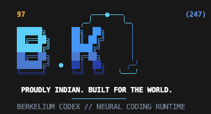

<div align="center">



# Berkelium CLI

### Berkelium Codex // Neural Coding Runtime
**PROUDLY INDIAN. BUILT FOR THE WORLD.**

> Your terminal. Your codebase. Your AI.

</div>

---

Berkelium CLI (Berkelium Codex) is a terminal-native AI software engineering agent and neural runtime. Built from the ground up for software developers, Berkelium unifies local inference (Apple Silicon MLX, GGUF/llama.cpp, CPU), cloud AI providers, local repository intelligence, and policy-gated tool execution into a single command-line interface.

Berkelium executes an autonomous engineering loop that inspects code, plans architectural changes, requests authorization, applies surgical edits, runs tests, and verifies fixes directly inside your terminal.

---

## Table of Contents

- [What is Berkelium?](#what-is-berkelium)
- [Why Berkelium?](#why-berkelium)
- [Terminal Demo](#terminal-demo)
- [Core Features](#core-features)
- [Quick Start](#quick-start)
- [Local Models](#local-models)
- [Cloud Models](#cloud-models)
- [Local / Cloud / Hybrid](#local--cloud--hybrid)
- [Agentic Development](#agentic-development)
- [Permissions](#permissions)
- [Working Directory](#working-directory)
- [Project Scan](#project-scan)
- [System Diagnostics](#system-diagnostics)
- [Git Safety & Checkpoints](#git-safety--checkpoints)
- [Security](#security)
- [Privacy](#privacy)
- [Accessibility](#accessibility)
- [Sessions](#sessions)
- [Slash Commands](#slash-commands)
- [CLI Reference](#cli-reference)
- [Configuration](#configuration)
- [Architecture](#architecture)
- [Troubleshooting](#troubleshooting)
- [Development](#development)
- [Contributing](#contributing)
- [Security Reporting](#security-reporting)
- [Roadmap](#roadmap)
- [License](#license)

---

## What is Berkelium?

Berkelium is a terminal-first engineering platform that integrates local and cloud language models directly with your development environment. Instead of copying snippets back and forth between a web browser and your editor, Berkelium operates directly on your filesystem and terminal tools with deterministic permission boundaries.

It is designed to deliver:
- **Local Autonomy**: Run models locally on Apple Silicon (MLX) or GGUF (llama.cpp) without sending proprietary code to third parties.
- **Cloud Scale**: Route high-complexity reasoning tasks to cloud providers (Gemini, Groq, OpenRouter, NVIDIA NIM, Hugging Face).
- **Engineering Safety**: Guarded filesystem operations, diff previews, transactional checkpoints, and strict permission policies.
- **Provider Neutrality**: Swap between local and cloud models without changing workflows or learning new interfaces.

---

## Why Berkelium?

| Capability | Generic Chatbots | Traditional CLI Wrappers | Berkelium CLI |
| :--- | :--- | :--- | :--- |
| **Execution Environment** | Web browser / isolated cloud | Shell scripts without policy | Terminal-native interactive agent |
| **Local Model Runtime** | Not supported | External daemon required | Built-in MLX, GGUF, CPU runtimes |
| **Permission Controls** | N/A | None or binary allow | 3-tier (`ASK`/`AUTO`/`FULL`) with protected command guards |
| **Working Directory Control** | None | Host shell only | Explicit tracking, path validation, Git root discovery |
| **Repository Intelligence** | Manual file copy | Blind file dumping | AST symbol mapping, ranking, context compaction |
| **Verification Loop** | Generates text and stops | Manual test runs | Autonomous inspect → plan → edit → test → verify |
| **Git Safety** | Untracked | Blind mutations | Transactional checkpoints, safe diffs, undo |
| **Credential Storage** | Plain text / browser | Environment variables only | macOS Keychain & encrypted vault isolation |

---

## Terminal Demo

Below is an authentic terminal session illustrating Berkelium's interactive loop:

```
$ berkelium
Berkelium CLI — Your terminal. Your codebase. Your AI.
~/Projects/my-app (main)

Model     <selected-model>
Runtime   MLX (Local)
Mode      BUILD
Status    ● READY

› /scan
Scanning project...
Repository:   my-app
Language:     TypeScript / Node.js
Files:        148 source, 45 test files
Git:          Clean (main)

› Fix failing tests in auth module
1. Inspecting src/auth/session.ts
2. Reproducing failure: vitest run tests/auth/session.test.ts
3. Generating implementation plan
4. Applying surgical patch to src/auth/session.ts
5. Running verification tests: 45 passed (0 failed)
✓ All tests passing. Working tree verified.
```

---

## Core Features

- **Working Directory Control**: Explicit path management (`pwd`, `ls`, `cd`, `--cwd`) with safe symlink resolution and automatic Git root detection.
- **First-Class Permission Engine**: 3 operational levels (`ASK`, `AUTO`, `FULL`) across 14 granular capabilities. High-risk destructive commands (`rm -rf`, `sudo`, `git reset --hard`, `git push --force`) always require explicit user confirmation.
- **Deep Scanners**: Built-in repository intelligence (`/scan`), Apple Silicon hardware and toolchain discovery (`/system`), and grounded secret leak analysis (`/security`).
- **7 Agent Modes**: Specialized behaviors for `ASK`, `PLAN` (strictly non-destructive), `BUILD`, `DEBUG`, `REVIEW`, `TEST`, and `REFACTOR`.
- **Autonomous Mission Execution**: Run `/mission <goal>` to decompose complex objectives into structured, verified subtasks with bounded iteration limits.
- **Git Checkpoints & Undo**: Snapshot working tree modifications with `/checkpoint` and safely restore previous states with `/restore` or `/undo`.
- **Local & Cloud Stack**: Run locally via Apple MLX, GGUF, Ollama, and LM Studio, or connect to Gemini, Groq, OpenRouter, NVIDIA, and Hugging Face.
- **Background Tasks**: Spawn and monitor long-running builds, test suites, or services with `/background` and `/tasks`.
- **Tool-Layer Network Controls**: Enforce outbound network access policies (`/network allow` or `/network deny`) physically at the tool orchestrator layer.

---

## Quick Start

### Requirements
- **macOS** (12.0+ recommended; Apple Silicon M1–M4 required for native MLX acceleration) or **Linux**
- **Node.js**: >= 20.0.0 (Node 22 or 26 recommended)
- **pnpm**: >= 9.0.0 (`corepack enable` or `npm i -g pnpm`)
- **Git**: >= 2.40.0

### Installation

Clone the repository and build from source:

```bash
git clone https://github.com/enigmahacker/BerkeliumCodex.git
cd BerkeliumCodex
pnpm install
pnpm run build
```

### Starting Berkelium

```bash
# Run directly via pnpm
pnpm berkelium

# Or link globally to access 'berkelium' and 'bk' commands anywhere
npm link
berkelium
```

### First Task

```bash
# Start an interactive session in your project directory
berkelium --cwd ~/Projects/my-app

# Or execute a single task non-interactively
berkelium run "Inspect package.json and run the test suite"
```

---

## Local Models

Berkelium provides an Ollama-style local model management experience where supported, while maintaining its own runtime and provider abstraction.

### CLI Model Commands

```bash
# List locally installed model weights
berkelium list

# Download model weights from Hugging Face
berkelium pull <model-id>

# Inspect model parameters, architecture, and quantization
berkelium show <model-id>

# Run a model in local interactive mode
berkelium run <model-id>

# List active local inference processes
berkelium ps

# Remove local model weights from disk
berkelium rm <model-id>

# Inspect local runtime engine status (MLX, GGUF, CPU)
berkelium runtime list
```

### Supported Local Runtimes

- **Apple MLX**: Hardware-accelerated inference utilizing Apple Silicon Unified Memory and Metal compute cores.
- **GGUF (llama.cpp)**: Quantized model execution via local `llama-server` subprocess.
- **CPU Fallback**: Cross-platform CPU inference engine.
- **Ollama Adapter**: Connects to an existing local Ollama instance at `http://127.0.0.1:11434`.
- **LM Studio Adapter**: Connects to a local LM Studio server at `http://127.0.0.1:1234`.

*Example output:*
```
LOCAL RUNTIME ENGINES
  Apple MLX            ● READY          (<detected-version>)
  GGUF (llama.cpp)     ● READY          (installed)
  CPU Fallback         ● READY          (active)
```

---

## Cloud Models

Berkelium connects to major cloud model providers through provider-agnostic adapters with native streaming, function/tool calling, and capability routing. Credentials are isolated in the macOS Keychain or an encrypted local vault.

### Provider Support Matrix

| Provider | Integration Type | Status | Supported Models & Capabilities |
| :--- | :--- | :--- | :--- |
| **OpenRouter** | Direct Adapter | Supported | **Anthropic**: Claude 3.7 Sonnet, Claude 3.7 Thinking, Claude 3.5 Sonnet, Claude 3.5 Haiku, Claude 3 Opus<br>**OpenAI**: GPT-4o, GPT-4o Mini, o3-mini, o3, o1, o1-mini, ChatGPT-4o<br>**DeepSeek**: DeepSeek R1, DeepSeek V3 |
| **NVIDIA NIM** | Direct Adapter | Supported | **DeepSeek**: DeepSeek R1, DeepSeek V3<br>**Meta**: Llama 3.3 70B, Llama 3.1 405B, Llama 3.1 8B<br>**NVIDIA**: Nemotron 70B, Nemotron 51B, Mistral NeMo 12B<br>**Qwen & Mistral**: Qwen 2.5 Coder 32B, Codestral 22B, Mistral Large 2 |
| **Google Gemini** | Direct Adapter | Supported | Gemini 3.8 Flash, Gemini 3.6 Flash, Gemini 3.1 Pro (Preview), Gemini 2.5 Pro |
| **Groq LPU** | Direct Adapter | Supported | DeepSeek R1 Distill (70B), Llama 3.3 70B Versatile, Llama 4 Maverick/Scout |
| **Hugging Face** | Direct Adapter | Supported | Meta Llama 3.3 70B, DeepSeek R1, Qwen 2.5 Coder 32B |
| **Ollama** | Local Service | Supported | Local models via `localhost:11434` with tool calling |
| **LM Studio** | Local Service | Supported | Local models via `localhost:1234/v1` with SSE streaming |

### Synced Model Options & Quick Switch

You can switch models instantly via CLI flag, runtime subcommands, or the interactive TUI picker:

#### Anthropic (Claude) Models
```bash
# Claude 3.7 Sonnet (Flagship hybrid reasoning & coding)
berkelium --model claude
berkelium model use claude

# Claude 3.7 Sonnet with Extended Thinking
berkelium --model claude-thinking
berkelium model use claude-thinking

# Claude 3.5 Sonnet & Claude 3.5 Haiku
berkelium --model claude-3.5-sonnet
berkelium --model claude-haiku
berkelium --model claude-opus
```

#### OpenAI Models
```bash
# GPT-4o Multimodal Flagship
berkelium --model gpt4o
berkelium model use gpt4o

# OpenAI o3-mini & o1 Frontier Reasoning
berkelium --model o3-mini
berkelium --model o1
berkelium --model gpt4o-mini
```

#### NVIDIA NIM Models
```bash
# DeepSeek R1 & DeepSeek V3 on NVIDIA NIM
berkelium --model nvidia-deepseek
berkelium --model nvidia-deepseek-v3

# Meta Llama 3.3 70B & Llama 3.1 405B on NVIDIA NIM
berkelium --model nvidia-llama
berkelium --model nvidia-llama-405b

# NVIDIA Nemotron 70B & 51B Aligned Enterprise Models
berkelium --model nvidia-nemotron
berkelium --model nvidia-nemotron-51b

# Qwen 2.5 Coder 32B & Codestral 22B on NVIDIA NIM
berkelium --model nvidia-qwen
berkelium --model nvidia-codestral
berkelium --model nvidia-mistral
```

#### Google Gemini & Groq LPU Models
```bash
berkelium --model gemini           # Gemini 3.6 Flash
berkelium --model gemini-pro       # Gemini 2.5 Pro
berkelium --model groq             # Llama 3.3 70B on Groq LPU
```

### Interactive Model Picker

```bash
# Launch interactive TUI model selector
berkelium model select

# Or in an active terminal session
/model
```

### Managing Cloud Credentials

```bash
# View authentication status
berkelium cloud status

# Authenticate with providers (stored securely in macOS Keychain / Vault)
berkelium cloud login openrouter
berkelium cloud login nvidia
berkelium cloud login gemini
berkelium cloud login groq

# Inspect available models across all providers
berkelium models
```

> **Security Invariant**: Berkelium uses official provider authentication mechanisms. It never accesses browser cookies, extracts tokens from other CLIs, or bypasses quotas. Raw API keys are never passed into model prompt contexts.

---

## Local / Cloud / Hybrid

Configure the execution topology using CLI flags or runtime commands:

```bash
berkelium mode <local|cloud|hybrid|auto>
```

- **`LOCAL`**: All inference runs strictly on-device via MLX, GGUF, or Ollama. Cloud network calls are disabled by policy.
- **`CLOUD`**: Requests are dispatched to configured cloud model providers.
- **`HYBRID`**: Local repository indexing, AST symbol mapping, and context preparation run on-device. Structured context is sent to cloud models for reasoning. Tool execution and test verification run locally.
- **`AUTO`**: Dynamically evaluates task requirements and routes to local or cloud models based on task complexity.

---

## Agentic Development

Berkelium implements a bounded, verified autonomous engineering loop:

```
REQUEST
   ↓
UNDERSTAND
   ↓
INSPECT
   ↓
PLAN
   ↓
AUTHORIZE
   ↓
EXECUTE
   ↓
TEST
   ↓
VERIFY
   ↓
REPORT
```

### Engineering Invariants
1. **Model Output is Not Authorization**: Code generated by a model is never executed without policy evaluation.
2. **Inspect Before Mutating**: Files are examined and diffs computed before modifications are applied.
3. **Verification Required**: Bug fixes and features are not considered complete until tests and diagnostics succeed.
4. **Bounded Iterations**: Loops enforce `maxIterations` (default 40), `maxToolCalls` (default 100), and execution timeouts to prevent runaway processes.

---

## Permissions

Berkelium features a three-tier permission engine with deterministic policy evaluation.

### Permission Levels

```bash
berkelium --permission <ask|auto|full>
```

- **`ASK`**: Every meaningful external action (file modification, shell command, package installation) prompts the user for confirmation.
- **`AUTO`**: Safe read-only operations (reading files, searching code, listing directories, read-only git queries) execute automatically. Mutating or higher-risk actions require user confirmation.
- **`FULL`**: Maximizes authorized autonomous execution within operating-system boundaries.

> **CRITICAL SAFETY INVARIANT**: `FULL` mode does NOT mean unrestricted malware-like execution. Dangerous destructive operations **always require explicit confirmation even in FULL mode**:
> - `rm -rf` / directory deletion
> - `sudo` / administrative escalation
> - `mkfs` / `dd` / raw disk writes
> - `chmod -R` / `chown -R`
> - `git reset --hard` / `git clean -fd`
> - `git push --force` / `git branch -D`
> - `diskutil` / partition modifications
> - `shutdown` / `reboot`

*Example confirmation prompt:*
```
⚠ HIGH-RISK OPERATION
Command: git reset --hard HEAD~1
Reason:  Modifies working tree and permanently discards uncommitted changes.
Allow? [y/N]
```

### Granular Capabilities
Permissions can be granted per capability across 4 scopes (`once`, `session`, `project`, `permanent`):
- `filesystem.read`, `filesystem.write`, `filesystem.delete`
- `shell.execute`, `process.spawn`, `process.kill`
- `git.read`, `git.write`
- `network.access`
- `package.install`
- `credential.access`

---

## Working Directory

Berkelium operates relative to an explicit working directory and never silently changes paths without validation.

```bash
# Set working directory at launch
berkelium --cwd ~/Projects/my-app

# Interactive commands
/pwd
/ls [path]
/cd <path>
```

*Example output:*
```
Working directory:
  ~/Projects/my-app
Repository:
  Detected Git repository (main)
Project:
  TypeScript / Node.js
```

When changing directories via `/cd`:
1. Validates destination path and resolves symlinks safely.
2. Detects Git root and current branch.
3. Recalculates project stack and context indices in `ContextEngine`.

---

## Project Scan

Inspect repository health and structure without running external tools:

```bash
# CLI command
berkelium scan [project|deep|security|dependencies|git|tests]

# Interactive slash command
/scan [type]
```

*Example output:*
```
PROJECT SCAN
Repository:             <repo-name>
Language:               TypeScript
Framework:              Node.js (Vitest)
Files:                  251
Source files:           148
Tests:                  45
Configs:                34
Documentation:          9
Packages:               18
Circular dependencies:  0
Git:
  Branch:               main
  Modified files:       0
  Untracked files:      0
```

---

## System Diagnostics

Inspect hardware capabilities, memory budgets, and installed toolchains:

```bash
# Full environment diagnostic check
berkelium doctor

# Hardware and runtime status
berkelium status

# Detailed hardware and toolchain scan
berkelium system scan
```

*Example output:*
```
SYSTEM SCAN
OS:                     darwin (<version>, arm64)
CPU:                    <detected-chip> (<core-count> cores)
Memory Total:           <total-ram>
Memory Available:       <available-ram>
GPU:                    Apple Metal GPU (<gpu-cores> cores)
Development Toolchains:
  • Node: <version>
  • Git: <version>
  • Python: <version>
  • Rust: <version>
  • Docker: <version>
```

---

## Git Safety & Checkpoints

Berkelium enforces strict Git safety invariants:
- **Never Silently Discard Changes**: Destructive operations require explicit user approval.
- **Diff-First Workflow**: Summaries and file diffs are displayed before changes are finalized.
- **Safe Checkpoints**: Create transactional snapshots of your working tree before risky operations.

### Checkpoint Commands

```bash
# Create a snapshot of current changes
/checkpoint [name]

# List saved checkpoints
/checkpoints

# Restore a specific checkpoint (creates safety backup first)
/restore <checkpoint-id>

# Undo latest checkpoint changes
/undo
```

---

## Security

Berkelium enforces layered defense-in-depth across the agent lifecycle:

### Security Controls
- **Secret Redaction**: API keys, AWS credentials, database URLs, and private keys are detected and masked before entering logs or prompt contexts (`OPENAI_API_KEY=••••••••`).
- **Prompt-Injection Defense**: External content (READMEs, issues, web pages, Git commits) is treated as untrusted data and cannot grant permissions or override security policies.
- **SSRF & Network Guard**: Blocks access to local metadata endpoints (`169.254.169.254`, loopback addresses) from web tools.
- **Process Isolation**: Shell commands run in sandboxed child processes with strict timeouts, process tree termination, and signal handling.

### Security Scanner

```bash
berkelium security scan
```

Scans the workspace and Git history for committed secrets, credentials, and insecure scripts.

*Example output:*
```
SECURITY ASSESSMENT REPORT
Workspace:  <workspace-path>
Files:      251 scanned

Findings:
  HIGH:     0
  MEDIUM:   0
  LOW:      0

This scan does not guarantee the absence of vulnerabilities.
```

---

## Privacy

Berkelium provides 4 configurable privacy tiers:

```bash
berkelium privacy <local|balanced|hybrid|cloud>
```

- **`local`**: Zero prompt data leaves the device. Cloud network requests are physically blocked at the tool layer.
- **`balanced`**: Allows cloud reasoning while blocking transmission of sensitive files (`.env`, `.pem`, credentials).
- **`hybrid`**: Prepares local index and context summaries on-device; queries cloud models for architecture and reasoning.
- **`cloud`**: Standard cloud execution mode.

---

## Accessibility

Berkelium is engineered for accessibility and screen readers:

| Capability | Status | Description |
| :--- | :--- | :--- |
| **`--plain` Mode** | Supported | Disables animations, spinners, and ANSI colors for clean screen-reader output |
| **`--json` Output** | Supported | Emits structured JSON for script integration and assistive tools |
| **Keyboard-Only Operation** | Supported | Full navigation via arrow keys, Tab, Enter, and Esc |
| **Emergency Stop (Ctrl+C)** | Supported | Immediately stops model streaming, tool execution, and child processes |
| **Voice Input (STT)** | Experimental | Voice commands via optional plugin |
| **Speech Output (TTS)** | Experimental | Spoken summaries and error announcements |

---

## Sessions

Interactive sessions are persisted to `~/.berkelium/sessions/<sessionId>.json`.

```bash
# List previous sessions
berkelium session list

# Resume the latest session
berkelium resume

# Resume a specific session
berkelium resume <session-id>
```

> **Privacy Invariant**: Session files record message history, token usage, and task metadata. No API keys, passwords, or credentials are ever written to session files.

---

## Slash Commands

Type `/` in the interactive prompt to open the instant command palette with fuzzy search:

```
────────────────────────────────────────────────────────────
Berkelium Commands
> /plan          Generate implementation plan without modifying files
  /build         Execute engineering loop (edit, test, verify)
  /debug         Diagnose failures and trace root causes
  /test          Run workspace test suite
  /review        Review working tree diff and code changes
  /scan          Run project, system, or security scan
  /checkpoint    Snapshot current changes
  /undo          Revert working tree to latest checkpoint
  /permissions   Configure permission level (ask, auto, full)
  /model         Select active model target
  /tasks         List and manage background tasks
  /network       Configure outbound network policy (allow/deny)
  /doctor        Run platform and provider health diagnostics
↑↓ Navigate   Enter Select   Esc Close
────────────────────────────────────────────────────────────
```

---

## CLI Reference

### Primary Commands

#### `berkelium`
Launch the interactive terminal UI.
```bash
berkelium [options]
```

#### `berkelium scan [type]`
Run project, dependency, git, test, or security scans.
```bash
berkelium scan project
berkelium scan deep
berkelium scan security
```

#### `berkelium system scan`
Scan operating system, hardware capabilities, memory budgets, and developer toolchains.
```bash
berkelium system scan
```

#### `berkelium security scan`
Scan codebase and Git history for leaked secrets, API keys, and vulnerabilities.
```bash
berkelium security scan
```

#### `berkelium doctor`
Run full diagnostic checks on local runtimes, cloud providers, and tool sandboxing.
```bash
berkelium doctor
berkelium doctor --json
```

#### `berkelium run <task>`
Execute an autonomous engineering task non-interactively.
```bash
berkelium run "Fix typecheck errors in packages/agent"
```

#### `berkelium list`
List installed local model weights.
```bash
berkelium list
```

#### `berkelium pull <model>`
Download model weights locally from Hugging Face Hub.
```bash
berkelium pull <repo/model-name>
```

#### `berkelium rm <model>`
Remove local model weights from disk.
```bash
berkelium rm <model-name>
```

#### `berkelium ps`
List active local model inference processes.
```bash
berkelium ps
```

#### `berkelium mode <mode>`
Set active inference mode (`local`, `cloud`, `hybrid`, `auto`).
```bash
berkelium mode local
```

#### `berkelium privacy <tier>`
Set active privacy tier (`local`, `balanced`, `hybrid`, `cloud`).
```bash
berkelium privacy local
```

#### `berkelium git <status|diff|history>`
Inspect working tree status, diffs, and commit history.
```bash
berkelium git status
berkelium git diff
```

#### `berkelium session <list|resume|delete>`
Manage persistent interactive sessions.
```bash
berkelium session list
berkelium session resume <session-id>
```

---

## Configuration

Berkelium resolves configuration through an explicit hierarchy:

`Defaults → Global Config (~/.berkelium/config.yaml) → Project Config (.berkelium/config.yaml) → Session Overrides → CLI Flags`

### Example `config.yaml`

```yaml
version: 1

theme:
  name: berkelium-dark

runtime:
  mode: hybrid
  mlx:
    enabled: true
    server_port: 8080
  gguf:
    enabled: true
    server_port: 8081

permissions:
  level: auto
  protected_operations: true

privacy:
  tier: balanced

ui:
  launch_animation: true
  launch_matrix: true
```

---

## Architecture

```
                 BERKELIUM CLI
                       │
                 Command Router
                       │
                Agent Orchestrator
                       │
        ┌──────────────┼──────────────┐
        │              │              │
     Context         Tools          Models
(RepoMapper,     (Filesystem,   (Capability Matrix,
 Compactor,       Shell, Git,    Unified Router,
 Memory)          Diagnostics)   Normalizer)
        │              │              │
        └──────────────┼──────────────┘
                       │
                 Policy Engine
        (PermissionEngine [ASK/AUTO/FULL],
         SecretRedactor, NetworkController)
                       │
             Local / Cloud Runtime
     (Apple MLX, GGUF, CPU, Ollama, LM Studio,
      Gemini, Groq, OpenRouter, NVIDIA, HF)
```

---

## Troubleshooting

| Symptom | Cause | Diagnostic Command | Resolution |
| :--- | :--- | :--- | :--- |
| **Local model fails to load** | Insufficient unified memory or runtime not installed | `berkelium doctor` | Switch to smaller quantized model or use cloud provider |
| **Cloud provider auth failed** | Missing or expired API key in Keychain | `berkelium cloud status` | Run `berkelium cloud login <provider>` |
| **Permission denied on tool** | Operation requires confirmation in `ASK` or `AUTO` mode | `/permissions` | Authorize prompt or grant capability with `/permission auto` |
| **Network blocked at tool layer** | Policy set to `NETWORK: BLOCKED` | `/network` | Run `/network allow` to enable outbound requests |
| **Port conflict on local server** | Default port in use by another service | `lsof -i :8080` | Update port in `~/.berkelium/config.yaml` |
| **Git working tree dirty** | Uncommitted modifications in working directory | `berkelium git status` | Run `/checkpoint` to snapshot changes before continuing |
| **Working directory not found** | Invalid path passed to `--cwd` or `/cd` | `/pwd` | Verify path exists and symlinks resolve cleanly |
| **Rate limit exceeded** | Cloud provider quota reached | `berkelium cloud usage` | Switch provider (`/provider <name>`) or use local model |
| **Session resume failed** | Session file missing or corrupted | `berkelium session list` | Start a new session with `berkelium` |

---

## Development

```bash
# Install dependencies
pnpm install

# Build all monorepo packages and applications
pnpm run build

# Run TypeScript typecheck across all packages
pnpm run typecheck

# Run unit and security test suites
pnpm run test

# Run performance benchmarks
pnpm run bench
```

---

## Contributing

Contributions are welcome. Please read [AGENTS.md](file:///Users/prithviaryam/Downloads/claude-code-main/AGENTS.md) and [DEVELOPMENT.md](file:///Users/prithviaryam/Downloads/claude-code-main/DEVELOPMENT.md) before submitting pull requests. All contributions must pass typechecking, tests, and adhere to architectural invariants.

---

## Security Reporting

If you discover a potential security vulnerability, please report it responsibly. Do not open public GitHub issues for security reports. Contact security maintainers directly via repository issue security advisories.

---

## Roadmap

- [x] Apple Silicon hardware detection and Unified Memory budgeting
- [x] Local runtime adapters (Apple MLX, GGUF/llama.cpp, CPU fallback)
- [x] Cloud provider adapters (Gemini, Groq, OpenRouter, NVIDIA NIM, Hugging Face)
- [x] Ollama and LM Studio local service integrations
- [x] 3-tier permission engine (`ASK`, `AUTO`, `FULL`) with protected operation guards
- [x] Working directory control (`pwd`, `ls`, `cd`, `--cwd`)
- [x] Repository, system, and security scanners
- [x] 7 Agent modes and non-destructive `PLAN` mode enforcement
- [x] Autonomous mission runner with bounded retries and iterations
- [x] Git checkpoints, diff preview, and transactional undo
- [x] Tool-layer outbound network enforcement
- [x] Persistent session management and resume
- [~] Direct native OpenAI & Anthropic provider adapters (available via OpenRouter)
- [~] Experimental voice and vision accessibility interfaces
- [ ] Distributed multi-agent orchestrator

---

## License

Licensed under the Apache-2.0 License or see repository for licensing details.
